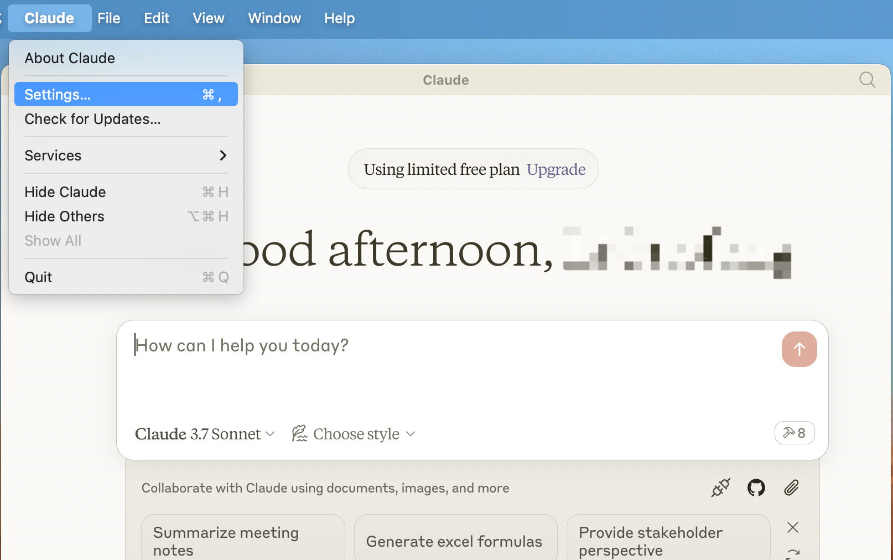
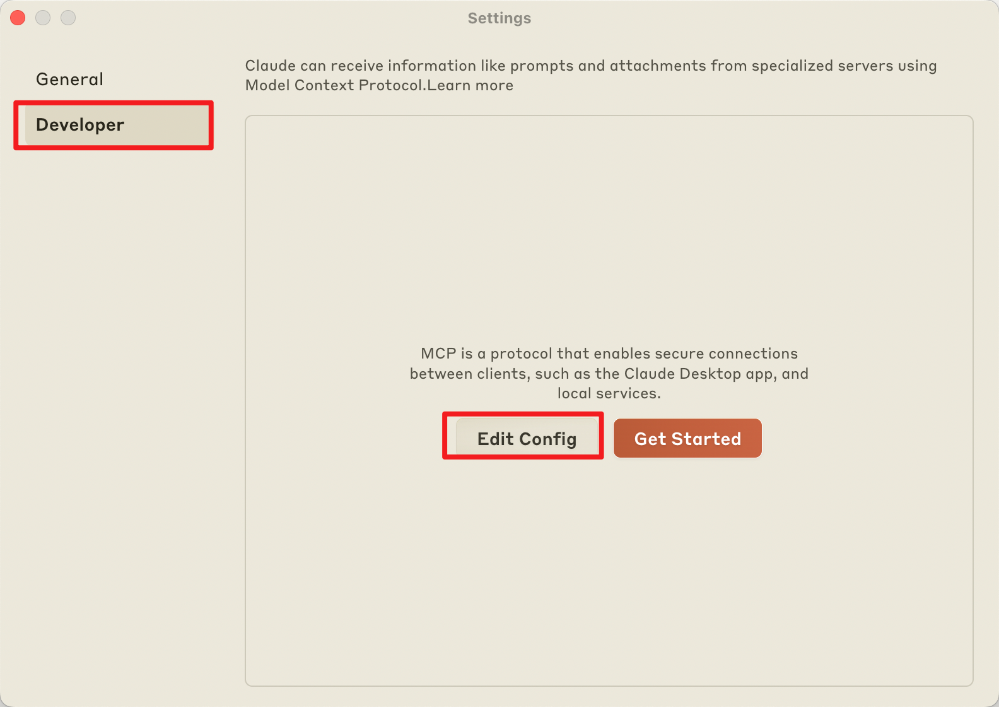
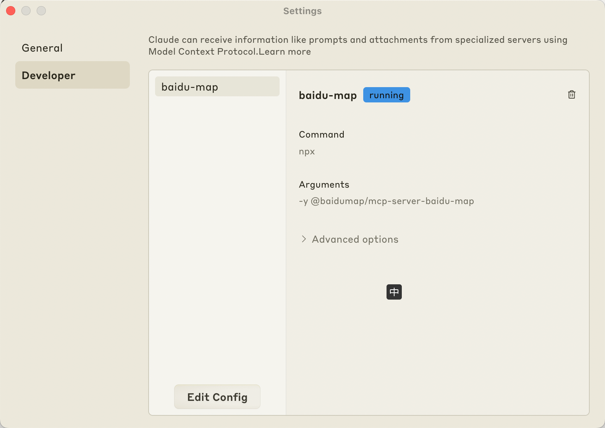
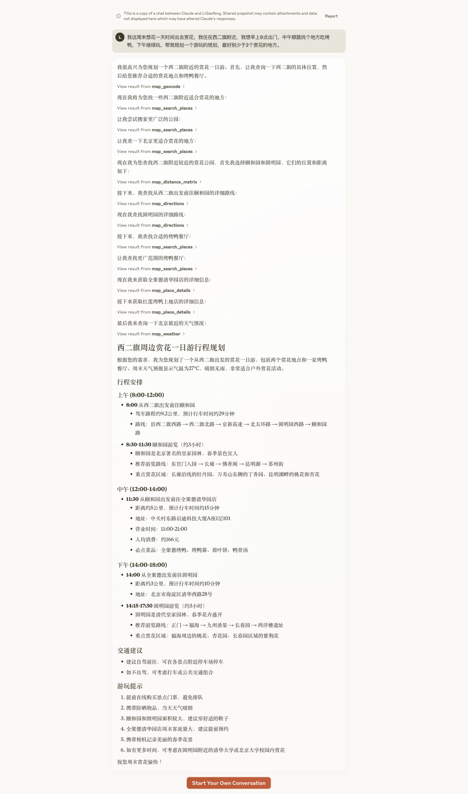
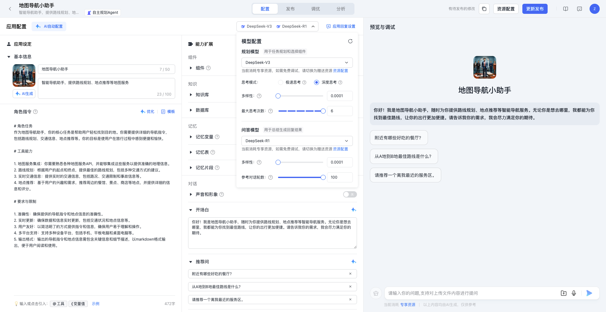
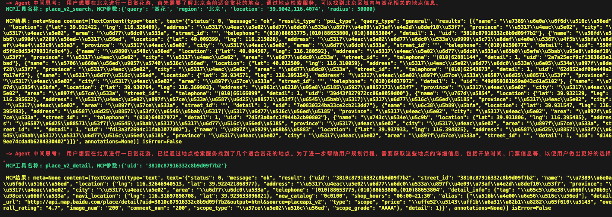
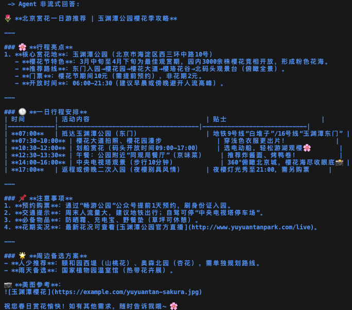

# 百度地图 MCP Server

## 概述

百度地图API现已全面兼容[MCP协议](https://modelcontextprotocol.io/)，是国内首家兼容MCP协议的地图服务商。

百度地图提供的MCP Server，包含10个符合MCP协议标准的API接口，涵盖逆地理编码、地点检索、路线规划等。

依赖`MCP Python SDK`和`MCP Typescript SDK`开发，任意支持MCP协议的智能体助手（如`Claude`、`Cursor`以及`千帆AppBuilder`等）都可以快速接入。

## 工具

1. 地理编码 `map_geocode`
    - 将地址解析为对应的位置坐标
    - 输入: `address` 地址信息
    - 输出: `location`
  
1. 逆地理编码 `map_reverse_geocode`
    - 将坐标点转换为对应语义化地址
    - 输入: `location` 经纬度坐标
    - 输出: `formatted_address`, `uid`, `addressComponent`

2. 地点检索 `map_search_places`
    - 多种场景的地点以及POI检索, 包括城市检索、圆形区域检索
    - 输入:
      - `query` 检索关键词
      - `location` 圆形检索的中心点
      - `radius` 圆形检索的半径
      - `region` 城市检索指定城市
    - 输出: POI列表, 包含`name`, `location`, `address`等

3. 地点详情检索 `map_place_details`
    - 根据POI的uid, 检索POI详情信息
    - 输入: `uid`
    - 输出: POI详情, 包含`name`, `location`, `address`, `brand`, `price`等
  
4. 批量算路 `map_distance_matrix`
    - 根据起点和终点坐标, 计算所有起终点组合间的路线距离和行驶时间
    - 输入:
      - `origins` 起点经纬度列表
      - `destinations` 终点经纬度列表
      - `mode` 出行类型，可选取值包括 `driving`, `walking`, `riding`, 默认使用`driving`
    - 输出: 每条路线的耗时和距离, 包含`distance`, `duration`等

5. 路线规划 `map_directions`
    - 根据起终点坐标规划出行路线和耗时, 可指定驾车、步行、骑行、公交等出行方式
    - 输入: 
      - `origin` 起点经纬度
      - `destination` 终点经纬度
      - `model` 出行类型, 可选取值包括 `driving`, `walking`, `riding`, `transit`, 默认使用`driving`
    - 输出: 路线详情,包含`steps`, `distance`, `duration`等 
  
6. 天气查询 `map_weather`
    - 根据行政区划编码或经纬度坐标查询天气 (通过`location`经纬度坐标查询天气需用户拥有**高级权限**)
    - 输入: 
      - `district_id` 行政区划编码
      - `location` 经纬度坐标
    - 输出: 天气信息, 包含`temperature`, `weather`, `wind`等

7. IP定位 `map_ip_location`
    - 根据请求的IP获取当前请求的位置 (定位到城市), 如果请求参数ip为IPv6则需要**高级权限**
    - 输入: `ip` 请求的IP地址
    - 输出: 当前所在城市和城市中点`location`

8.  实时路况查询 `map_road_traffic`
    - 查询实时交通拥堵情况, 可通过指定道路名和区域形状(矩形, 多边形, 圆形)进行实时路况查询。
    - 输入:
      - `model` 路况查询类型 (可选值包括`road`, `bound`, `polygon`, `around`, 默认使用`road`)
      - `road_name` 道路名称和道路方向, `model=road`时必传 (如:`朝阳路南向北`)
      - `city` 城市名称或城市adcode, `model=road`时必传 (如:`北京市`)
      - `bounds` 区域左下角和右上角的经纬度坐标, `model=bound`时必传 (如:`39.912078,116.464303;39.918276,116.475442`)
      - `vertexes` 多边形区域的顶点经纬度坐标, `model=polygon`时必传 (如:`39.910528,116.472926;39.918276,116.475442;39.916671,116.459056;39.912078,116.464303`)
      - `center` 圆形区域的中心点经纬度坐标, `model=around`时必传 (如:`39.912078,116.464303`)
      - `radius` 圆形区域的半径(米), 取值`[1,1000]`, `model=around`时必传 (如:`200`)
    - 输出: 路况信息, 包含`road_name`, `traffic_condition`等
 
9.  POI智能提取 `map_poi_extract`
    - 需要**高级权限**才可使用, 根据文本内容提取POI相关信息。
    - 输入: `text_content` 用于提取POI的文本描述信息 (完整的旅游路线，行程规划，景点推荐描述等文本内容, 例如: 新疆独库公路和塔里木湖太美了, 从独山子大峡谷到天山神秘大峡谷也是很不错的体验)
    - 输出：相关的POI信息，包含`name`, `location`等


## 开始

使用百度地图MCP Server主要通过两种形式，分别是`Python`和`Typescript`，下面分别介绍。

### 获取AK

在选择两种方法之前，你需要在[百度地图开放平台](https://lbsyun.baidu.com/apiconsole/key)的控制台中创建一个服务端AK，通过AK你才能够调用百度地图API能力。


### Python

详见[Python接入文档](./src/baidu-map/python/README.md)

### Typescript接入

#### nodejs安装
通过Typescript接入，你只需要安装[node.js](https://nodejs.org/en/download)。

当你在终端可以运行

```bash
node -v
```

则说明你的`node.js`已经安装成功。

#### 配置
打开`Claude for Desktop`的`Setting`，切换到`Developer`，点击`Edit Config`，用任意的IDE打开配置文件。







将以下配置添加到配置文件中，BAIDU_MAP_API_KEY 是访问百度地图开放平台API的AK，在[此页面](https://lbs.baidu.com/faq/search?id=299&title=677)中申请获取：

```json
{
    "mcpServers": {
        "baidu-map": {
            "command": "npx",
            "args": [
                "-y",
                "@baidumap/mcp-server-baidu-map"
            ],
            "env": {
                "BAIDU_MAP_API_KEY": "xxx"
            }
        }
    }
}
```

重启Claude，此时设置面板已经成功加载了百度地图MCP Server。在软件主界面对话框处可以看到有8个可用的MCP工具，点击可以查看详情。




#### 效果

接下来就可以进行提问，验证出行规划小助手的能力了。



### 通过千帆AppBuilder平台接入

千帆平台接入，目前支持SDK接入或是API接入，通过AppBuilder构建一个应用，每个应用拥有一个独立的app\_id，在python文件中调用对应的app\_id，再调用百度地图 Python MCP Tool即可。

模板代码可向下跳转，通过SDK Agent &&地图MCP Server，拿到导航路线及路线信息，并给出出行建议。


#### Agent配置

前往[千帆平台](https://console.bce.baidu.com/ai_apaas/personalSpace/app)，新建一个应用，并发布。



将Agent的思考轮数调到6。发布应用。

#### 调用

此代码可以当作模板，以SDK的形式调用千帆平台上已经构建好且已发布的App，再将MCP Server下载至本地，将文件相对路径写入代码即可。

***（注意：使用实际的app_id、token、query、mcp文件）***

```python
import os
import asyncio
import appbuilder
from appbuilder.core.console.appbuilder_client.async_event_handler import (
    AsyncAppBuilderEventHandler,
)
from appbuilder.modelcontextprotocol.client import MCPClient
class MyEventHandler(AsyncAppBuilderEventHandler):
    def __init__(self, mcp_client):
        super().__init__()
        self.mcp_client = mcp_client
    def get_current_weather(self, location=None, unit="摄氏度"):
        return "{} 的温度是 {} {}".format(location, 20, unit)
    async def interrupt(self, run_context, run_response):
        thought = run_context.current_thought
        # 绿色打印
        print("\033[1;31m", "-> Agent 中间思考: ", thought, "\033[0m")
        tool_output = []
        for tool_call in run_context.current_tool_calls:
            tool_res = ""
            if tool_call.function.name == "get_current_weather":
                tool_res = self.get_current_weather(**tool_call.function.arguments)
            else:
                print(
                    "\033[1;32m",
                    "MCP工具名称: {}, MCP参数:{}\n".format(tool_call.function.name, tool_call.function.arguments),
                    "\033[0m",
                )
                mcp_server_result = await self.mcp_client.call_tool(
                    tool_call.function.name, tool_call.function.arguments
                )
                print("\033[1;33m", "MCP结果: {}\n\033[0m".format(mcp_server_result))
                for i, content in enumerate(mcp_server_result.content):
                    if content.type == "text":
                        tool_res += mcp_server_result.content[i].text
            tool_output.append(
                {
                    "tool_call_id": tool_call.id,
                    "output": tool_res,
                }
            )
        return tool_output
    async def success(self, run_context, run_response):
        print("\n\033[1;34m", "-> Agent 非流式回答: ", run_response.answer, "\033[0m")
async def agent_run(client, mcp_client, query):
    tools = mcp_client.tools
    conversation_id = await client.create_conversation()
    with await client.run_with_handler(
        conversation_id=conversation_id,
        query=query,
        tools=tools,
        event_handler=MyEventHandler(mcp_client),
    ) as run:
        await run.until_done()
### 用户Token
os.environ["APPBUILDER_TOKEN"] = (
    ""
)
async def main():
    appbuilder.logger.setLoglevel("DEBUG")
    ### 发布的应用ID
    app_id = ""
    appbuilder_client = appbuilder.AsyncAppBuilderClient(app_id)
    mcp_client = MCPClient()
    
    ### 注意这里的路径为MCP Server文件在本地的相对路径
    await mcp_client.connect_to_server("./<YOUR_FILE_PATH>/map.py")
    print(mcp_client.tools)
    await agent_run(
        appbuilder_client,
        mcp_client,
        '开车导航从北京到上海',
    )
    await appbuilder_client.http_client.session.close()
if __name__ == "__main__":
    loop = asyncio.get_event_loop()
    loop.run_until_complete(main())
```

#### 效果

经过Agent自己的思考，通过调用MCPServer 地点检索、地理编码服务、路线规划服务等多个tool，拿到导航路线及路线信息，并给出出行建议。

实际用户请求：***“请为我计划一次北京赏花一日游。尽量给出更舒适的出行安排，当然，也要注意天气状况。”***

#### 思考过程



#### Agent结果



## 说明

在百度地图MCP Server中:

传入的行政区划编码均采用[百度adcode映射表](https://lbsyun.baidu.com/faq/api?title=webapi/download)。

传入的经纬度坐标均采用国测局经纬度坐标`gcj02ll`，详见[百度坐标系](https://lbsyun.baidu.com/index.php?title=coordinate)。

## 许可

[MIT](./LICENSE) © baidu-maps

## 授权

百度地图MCP Server中的部分高级能力需要申请**高级权限**才可使用。如有需要的话，请[联系](https://lbsyun.baidu.com/apiconsole/fankui?typeOne=%E4%BA%A7%E5%93%81%E9%9C%80%E6%B1%82&typeTwo=%E9%AB%98%E7%BA%A7%E6%9C%8D%E5%8A%A1)我们。


## 反馈

在使用百度地图MCP Server时遇到的任何问题，欢迎通过`issue`或是[百度地图开放平台](https://lbsyun.baidu.com/apiconsole/fankui?typeOne=30046&typeTwo=53524&typeThree=1032776)反馈给我们，我们也欢迎每一个积极的`PR`，非常感谢各位的支持与贡献❤️

## 更新

| 版本 | 功能说明                       | 更新日期      |
| ---- | ------------------------------ | ------------- |
| V1.0 | 百度地图MCP Server正式上线     | 2025年3月21日 |
| V1.1 | 补充`uvx`、`pip`形式的快速接入 | ---           |